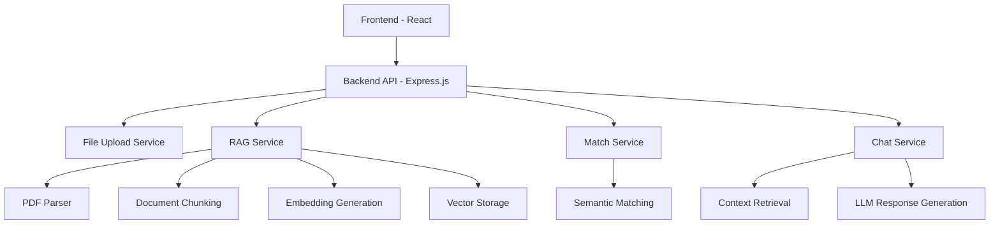

# Resume Screening Tool with RAG

## Project Overview
A sophisticated AI-powered Resume Screening Tool that enables recruiters to upload resumes and job descriptions, receive instant match scores, and engage in context-aware chat conversations about candidates. The system leverages Retrieval-Augmented Generation (RAG) to provide accurate, relevant analysis.

## Tech Stack
- **Backend**: Node.js 18+ with Express.js
- **Frontend**: React 18 with TypeScript
- **AI/ML**: Google Generative AI (Gemini) for LLM and embeddings
- **PDF Processing**: pdf-parse
- **Storage**: In-memory storage (for demonstration)

## Project Structure
```
resume-screening-tool/
├── backend/
│   ├── src/
│   │   ├── controllers/
│   │   ├── routes/
│   │   ├── services/
│   │   ├── utils/
│   │   └── index.ts
│   ├── config/
│   └── package.json
├── frontend/
│   ├── src/
│   │   ├── components/
│   │   ├── pages/
│   │   ├── services/
│   │   └── App.tsx
│   └── package.json
├── samples/
│   ├── resumes/
│   └── job-descriptions/
└── README.md
```

## Architecture Overview



### Key Components

1. **File Upload Service**: Handles PDF and TXT file uploads for resumes and job descriptions
2. **RAG Service**: Processes documents, generates embeddings, and manages vector storage
3. **Match Service**: Calculates match scores and identifies strengths/gaps between resumes and job descriptions
4. **Chat Service**: Provides context-aware Q&A about candidates using retrieved information
5. **PDF Parser**: Extracts text content from PDF files
6. **Semantic Matching**: Uses AI to understand context and meaning beyond keyword matching

## Setup Instructions

### Prerequisites
- Node.js 18+ installed
- npm or yarn package manager
- Google Generative AI API key

### Backend Setup
1. Navigate to the backend directory:
   ```
   cd backend
   ```

2. Install dependencies:
   ```
   npm install
   ```

3. Create a `.env` file in the backend directory with your API keys:
   ```
   PORT=3000
   GOOGLE_API_KEY=your_google_api_key_here
   ```

4. Start the backend server:
   ```
   npm run dev
   ```

   The backend server will start on `http://localhost:3000`

### Frontend Setup
1. Navigate to the frontend directory:
   ```
   cd frontend
   ```

2. Install dependencies:
   ```
   npm install
   ```

3. Start the frontend development server:
   ```
   npm start
   ```

   The frontend will start on `http://localhost:3000` (or the next available port)

## API Documentation

### Resume Analysis Endpoints

#### Upload Files
- **Endpoint**: `POST /api/resume/upload`
- **Description**: Upload resume and job description files
- **Request Body**: Form data with `resume` and `jobDescription` fields
- **Response**:
  ```json
  {
    "message": "Files uploaded successfully",
    "analysisId": "unique_analysis_id"
  }
  ```

#### Analyze Resume
- **Endpoint**: `POST /api/resume/analyze`
- **Description**: Analyze uploaded files and generate match score
- **Request Body**:
  ```json
  {
    "analysisId": "unique_analysis_id"
  }
  ```
- **Response**:
  ```json
  {
    "message": "Analysis completed successfully",
    "analysisId": "unique_analysis_id",
    "results": {
      "matchScore": 85,
      "strengths": ["Node.js", "REST API", "PostgreSQL"],
      "gaps": ["Kubernetes", "AWS Lambda"],
      "insights": ["Strong backend fundamentals", "Cloud exposure limited"],
      "structuredAnalysis": {
        "overallMatch": "⭐ Match Score: 85% — Strong Match",
        "strengths": ["3+ years experience with Node.js / REST API development"],
        "gaps": ["No explicit experience with Kubernetes"],
        "insights": ["Candidate is strong on backend, databases, and API design"],
        "summary": "Backend engineer with experience in REST APIs, SQL/NoSQL databases"
      }
    }
  }
  ```

#### Get Analysis Results
- **Endpoint**: `GET /api/resume/analysis/:id`
- **Description**: Retrieve analysis results by ID
- **Response**:
  ```json
  {
    "analysisId": "unique_analysis_id",
    "results": {
      "matchScore": 85,
      "strengths": ["Node.js", "REST API", "PostgreSQL"],
      "gaps": ["Kubernetes", "AWS Lambda"],
      "insights": ["Strong backend fundamentals", "Cloud exposure limited"],
      "structuredAnalysis": {
        "overallMatch": "⭐ Match Score: 85% — Strong Match",
        "strengths": ["3+ years experience with Node.js / REST API development"],
        "gaps": ["No explicit experience with Kubernetes"],
        "insights": ["Candidate is strong on backend, databases, and API design"],
        "summary": "Backend engineer with experience in REST APIs, SQL/NoSQL databases"
      },
      "resumeText": "Full resume text content",
      "jobDescriptionText": "Full job description text content",
      "processedAt": "2023-01-01T00:00:00.000Z"
    }
  }
  ```

### Chat Interface Endpoints

#### Ask Question
- **Endpoint**: `POST /api/chat/ask`
- **Description**: Ask a question about the resume using RAG
- **Request Body**:
  ```json
  {
    "analysisId": "unique_analysis_id",
    "question": "What is the candidate's experience with databases?"
  }
  ```
- **Response**:
  ```json
  {
    "answer": "The candidate has experience with both SQL (PostgreSQL) and NoSQL (MongoDB) databases...",
    "sources": ["Resume section 1", "Job description requirement 3"]
  }
  ```

#### Get Chat History
- **Endpoint**: `GET /api/chat/history/:analysisId`
- **Description**: Retrieve chat history for a specific analysis
- **Response**:
  ```json
  {
    "history": [
      {
        "question": "What is the candidate's experience with databases?",
        "answer": "The candidate has experience with both SQL (PostgreSQL) and NoSQL (MongoDB) databases...",
        "timestamp": "2023-01-01T00:00:00.000Z"
      }
    ]
  }
  ```

## Features Implemented

### Backend Features
1. **Resume Parser**
   - Extract text from PDF/TXT resumes
   - Extract text from PDF/TXT job descriptions

2. **RAG Implementation**
   - Document processing (text extraction and chunking)
   - Embedding generation for resume chunks
   - Vector storage and retrieval
   - Augmented generation with LLM

3. **REST API**
   - File upload endpoints
   - Match scoring endpoint
   - Chat interface endpoint

4. **Match Scoring System**
   - Calculate match percentage based on job requirements vs resume content
   - Identify strengths and gaps
   - Provide detailed insights and recommendations

### Frontend Features
1. **File Upload Interface**
   - Resume upload (PDF/TXT)
   - Job description upload (PDF/TXT)

2. **Match Analysis Display**
   - Match score visualization
   - Strengths section
   - Gaps section
   - Key insights
   - Detailed resume summary

3. **Chat Interface**
   - RAG-powered Q&A about candidates
   - Conversation context maintenance

## Sample Files
The `samples/` directory contains sample resumes and job descriptions for testing the application:
- Resume: `samples/resumes/sample_resume.txt`
- Job Description: `samples/job-descriptions/sample_job_description.txt`

## Testing the Application
1. Open your browser and navigate to `http://localhost:3000`
2. Upload a resume and job description from the `samples` directory
3. Click "Analyze Resume" to see the match score and analysis
4. Use the chat interface to ask questions about the candidate

## Troubleshooting

### Common Issues
1. **Port already in use**: If port 3000 is already in use, change the PORT value in the `.env` file
2. **API key errors**: Make sure you have a valid Google Generative AI API key in your `.env` file
3. **CORS errors**: The backend and frontend are configured to work together, but if you encounter CORS issues, check the cors configuration in `backend/src/index.ts`
4. **File upload issues**: Make sure you're uploading files in PDF or TXT format

### Need Help?
If you encounter any issues, please check:
1. All dependencies are installed correctly
2. API keys are valid and properly configured
3. The backend server is running before starting the frontend

## Critical Requirements Met
- ✅ Actual RAG implementation (not just direct LLM queries)
- ✅ Document processing and chunking
- ✅ Embedding generation
- ✅ Vector storage and retrieval
- ✅ Context-aware chat responses
- ✅ Semantic matching beyond keyword matching
- ✅ Detailed match analysis with strengths, gaps, and insights